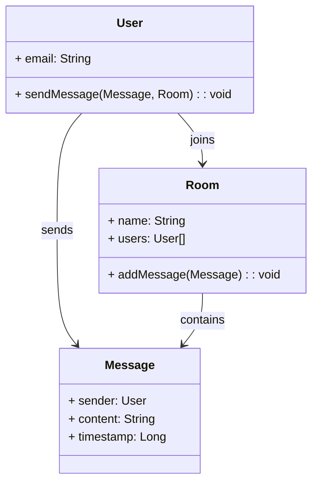

# Convo Connect

Chat application

  

---

### Example class diagram:

```mermaid
classDiagram
class User {
  + email: String
  + sendMessage(Message, Room): void
}
class Message {
  + sender: User
  + content: String
  + timestamp: Long
}
class Room {
  + name: String
  + users: User[]
  + addMessage(Message): void
}
User --> Message : sends
User --> Room : joins
Room --> Message : contains
```
